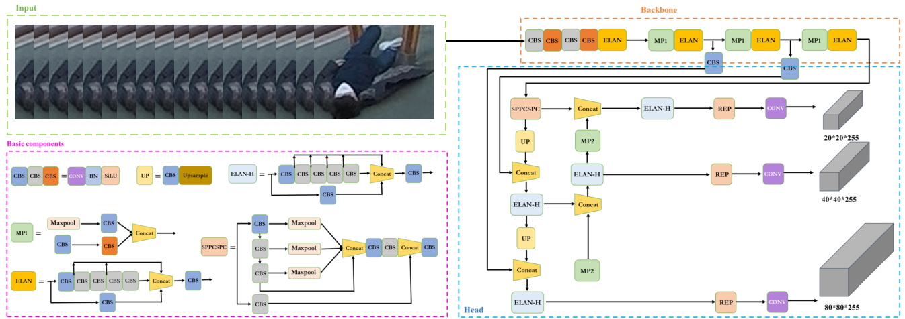
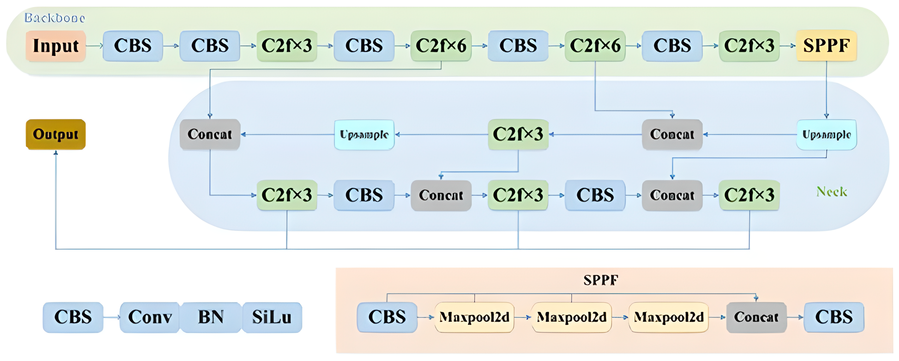
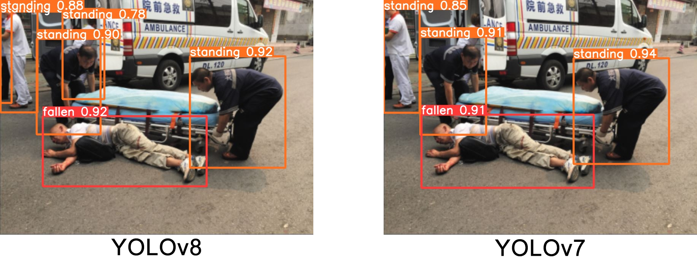

# DEEP LEARNING-BASED HUMAN DETECTION FOR FALL INJURIES

Falls are among the most common causes of injuries, regardless of age. Falling may seem like a minor accident, but the injuries that can result from a fall and the underlying health issues that can cause falls significantly impact human life. Especially in elderly individuals, such accidents occur more frequently and lead to more severe consequences. Research studies reveal that one-third of elderly individuals living in home environments and over half of hospitalized elderly patients are at risk of falling. Falls can result in impaired balance and gait, fear of falling, disability, and a decline in daily activities and quality of life. This fear adversely affects the daily lives of elderly individuals. Therefore, real-time fall detection systems contribute to preventing more severe injuries. The intended project aims to be tested in elderly care centers. Its goal is to ensure rapid delivery of assistance to the individual who fell after the incident. In the development stage of the project, YOLOv7 and YOLOv8 architectures have been utilized. By enabling the algorithms to operate in real-time, the project aims to bring innovation to the field compared to previous active studies.

by Esmanur ALICAN and Buse SARICAYIR
