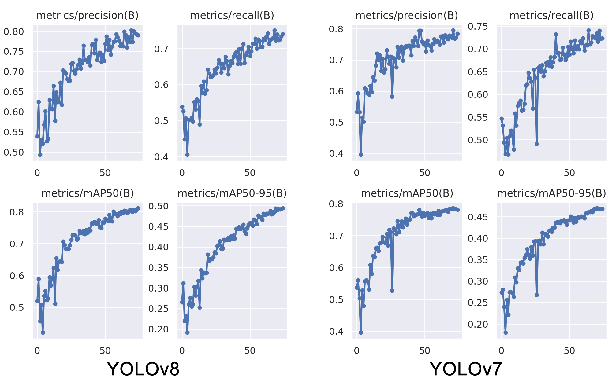

# DEEP LEARNING-BASED HUMAN DETECTION FOR FALL INJURIES

Falls are unforeseeable events that can lead to severe consequences such as injuries and even death due to accidents. Following injuries resulting from a fall, an individual may become incapable of calling for help or, in a worse scenario, experience loss of consciousness. Injuries arising from falls are particularly significant issues faced by the elderly population. In Turkey, the elderly population is rising  compared to past periods. If this trend continues, approximately one-third of the country's population is projected to be aged 65 and above in the coming years. Consequently, an increase in elderly care facilities is expected to occur.
   Care centers for the elderly play a significant role in ensuring the well-being and safety of the elderly. One of the major concerns in such facilities is the occurrence of fall-related injuries that can affect the elderly. While falling might seem like a minor accident, fall injuries and the underlying health issues contributing to falls can substantially impact human lives. Falls are among the most common causes of injury, regardless of age. Such accidents are more prevalent, and their consequences are more severe, particularly among the elderly population. In 2017, the elderly population constituted 8.9% of the world's population. The top three countries with the highest proportion of elderly citizens were Monaco at 32.2%, Japan at 27.9%, and Germany at 22.1%. Turkey ranked 66th among 167 countries in this regard.
   Research indicates that one-third of the elderly living at home or in nursing homes, and more than half of those in hospitals, are at risk of falling. Research shows that an increasing number of older people are afraid of falls and the complications that can arise as a result. This fear adversely impacts the daily lives of the elderly [4]. Falls can lead to a loss of independence among the elderly. They might encounter difficulties in their daily activities and become reliant on assistance. The daily routines and lifestyle of the elderly can change. Falls can have emotional ramifications as well. Fear, anxiety, and insecurity can lead to social isolation among the elderly. Injuries resulting from falls can increase healthcare utilization and costs.
   Therefore, our study aims to develop a system that employs deep learning using the dataset we have prepared, aiming to detect potential fall incidents within elderly care centers. The primary goal is to decrease the intervention time for injuries resulting from falls among the elderly, and, through an application that facilitates patient access, provide real-time information to caregivers regarding accident victims.

#YOLOv7
   YOLOv7 is an advanced real-time object detection algorithm compared to previous versions in terms of speed and accuracy. As shown in Figure 1, YOLOv7 achieves this by having fewer parameters than other YOLO versions, making it capable of operating efficiently with low computational power. To enhance detection performance and accuracy in YOLOv7's design, significant changes have been made to create specific modules. The Extended Efficient Layer Aggregation Network (E-ELAN) is integrated into the CSPDarknet backbone of YOLOv7. The Efficient Layer Aggregation Network (ELAN) is designed to efficiently construct networks by following the longest short gradient path. E-ELAN is a modified version of this structure. YOLOv7 incorporates the pre-processing method from YOLOv5. For identifying sections (modules) within the overall model that require re-parameterization, YOLOv7 employs gradient flow propagation methods. In general, YOLOv7 employs a more effective feature integration method, resulting in more accurate object detection performance. Consequently, YOLOv7 demands less costly hardware for computational processing compared to other deep learning models. It can be trained much faster on small datasets without pre-trained weights.

  

by Esmanur ALICAN and Buse SARICAYIR
